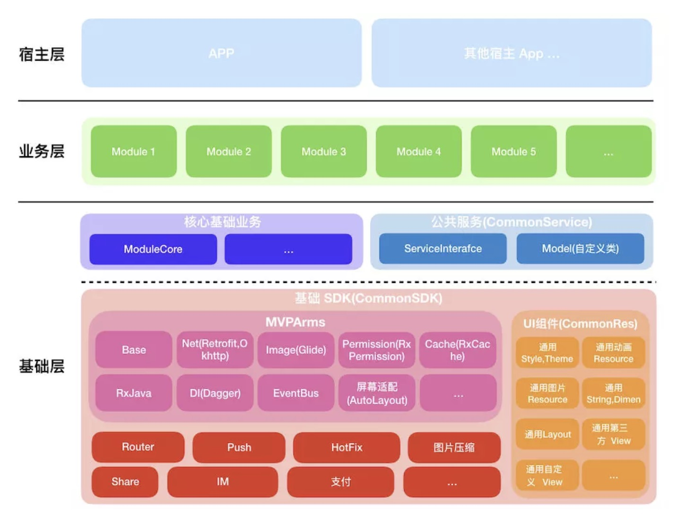

# Android-Components-Framework

Android-Components-Framework

## 架构图

## Reference Link

[组件化框架简介](https://www.jianshu.com/p/40e745038471)

[ARouter](https://github.com/alibaba/ARouter)

[Android路由ARouter初步体验](https://www.jianshu.com/p/fb20ab18c4cb?from=timeline&isappinstalled=0)

[电商APP组件化探索](https://mp.weixin.qq.com/s/hey2ZcsgucLVEGYJ2qfVWA?)

[MVPArms官方快速组件化方案](https://www.jianshu.com/p/f671dd76868f)

[从零开始搭建Android组件化框架](https://www.jianshu.com/p/ba32488f9555)

